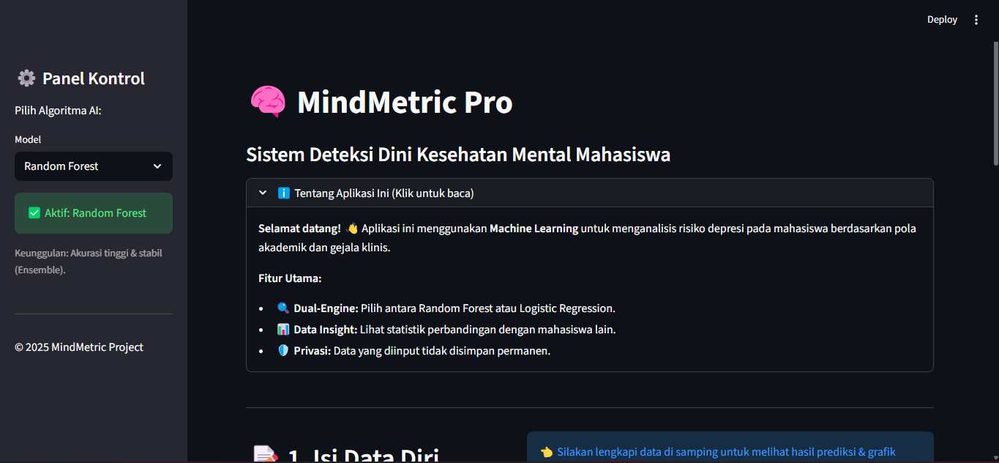

# 🧠 MindMetric


**Sistem Analisis & Deteksi Dini Kesehatan Mental Mahasiswa Berbasis Machine Learning.**

## 📋 Tentang Project
**MindMetric** adalah aplikasi web interaktif yang dirancang untuk mendeteksi potensi risiko depresi pada mahasiswa. Aplikasi ini menganalisis pola kesehatan mental berdasarkan data demografis, akademik (IPK), dan riwayat gejala klinis.

Project ini dikembangkan sebagai tugas **Ujian Akhir Semester (UAS)** mata kuliah Machine Learning.

### ✨ Fitur Unggulan
1.  **⚙️ Dual-Engine AI:** Pengguna dapat memilih dan membandingkan dua algoritma prediksi:
    * 🌲 **Random Forest Classifier** (Akurasi Tinggi & Stabil)
    * 📈 **Logistic Regression** (Efisien & Probabilistik)
2.  **📊 Interactive Dashboard:** Dilengkapi grafik visual (*Pie Chart* & *Bar Chart*) untuk membandingkan posisi pengguna dengan statistik populasi kampus.
3.  **🧠 Smart Preprocessing:** Menggunakan teknik *binning* pada data IPK untuk hasil analisis yang lebih objektif.
4.  **⚡ Real-time Analysis:** Hasil prediksi risiko dan persentase probabilitas muncul seketika.

---

## 📸 Tampilan Aplikasi (Screenshots)

Berikut adalah antarmuka dari aplikasi MindMetric:

### 1. Halaman Utama & Form Input


---

## 🛠️ Teknologi yang Digunakan
* **Bahasa Pemrograman:** Python
* **Web Framework:** Streamlit
* **Machine Learning:** Scikit-Learn
* **Data Processing:** Pandas, NumPy
* **Visualisasi Data:** Plotly Express

---

## 📂 Struktur Folder
```text
MindMetric-Pro/
├── aplikasi.py          # File utama (Frontend Streamlit)
├── model.py             # Script untuk melatih & menyimpan model AI
├── model_rf.pkl         # Otak AI (Random Forest)
├── model_lr.pkl         # Otak AI (Logistic Regression)
├── Student Mental health.csv  # Dataset
├── requirements.txt     # Daftar library yang dibutuhkan
└── README.md            # Dokumentasi ini
